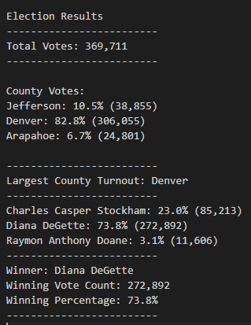
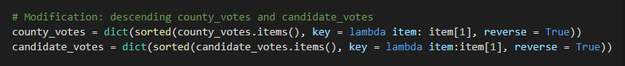
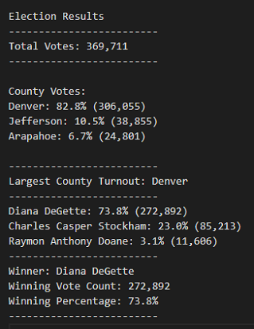

# Election Analysis

## Project Overview

### Original Project Overview
A Colorado Board of Elections employee has given us the following tasks to complete the election audit of a recent local congressional election.

1.	Calculate the total number of votes cast.
2.	Get a complete list of candidates who received votes.
3.	Calculate the total number of votes each candidate received.
4.	Calculate the percentage of votes each candidate won.
5.	Determine the winner of the election based on popular vote.

### Challenge Overview
The original project shows the audit results based on candidate information. This challenge aims at adding the following information to the election analysis. By doing this, our project will have complete election results of each candidate and county. 

1.	Get a complete list of counties in this election.
2.	Calculate the voter turnout for each county.
3.	Calculate the percentage of votes from each county out of the total count.
4.	Determine the county with the largest turnout.

## Resources
-	Data Source: election_results.csv
-	Software: Python 3.7.6, Visual Studio Code, 1.52.1

## Results
The table below presents the results of this election audit. The results show that:

- There were 369,711 votes cast in the election.

### Results based on County:
- The counties were:
   - Jefferson
   - Denver
   - Arapahoe
   
 - The county results were:
   - Jefferson received 10.5% of the total votes and 38,855 number of votes.
   - Denver received 82.8% of the total votes and 306,055 number of votes.
   - Arapahoe received 6.7% of the total votes and 24,801 number of votes.
   
 - The county with the largest vote turnout was:
   - County Denver, which received 82.8% of the total votes and 306,055 number of votes.
   
### Results based on Candidate:
- The candidates were:
   - Charles Casper Stockham
   - Diana DeGette
   - Raymon Anthony Doane

- The candidate results were:
   - Charles Casper Stockham received 23.0% of the vote and 85,213 number of votes.
   - Diana DeGette received 73.8% of the vote and 272,892 number of votes.
   - Raymon Anthony Doane received 3.1% of the vote and 11,606 number of votes.
   
- The winner of the selection was:
    - Candidate Diana DeGette, who received 73.8% of the vote and 272,892 number of votes.
    
Table of Election Results:

## Summary
This script provides us the Colorado election audit results. It counts vote efficiently and makes the result easy to read. With some modifications, we believe that it can be widely used for any election.

Our current script presents the results based on County and Candidate separately. One modification is that we can separate the votes based on candidates within each county. In this way, we can have detailed information about candidate’s votes within each county.

The current election results show County vote turnout and Candidate votes without an order. By adding sorted function in our script, we can show the vote information in a descending order. For example, by adding the following code to our script, our results show as follows:

In this way, we can easily find out the county with the largest vote turnout and the winning candidate.

To summarize, our script gives us the election audit results quickly and efficiently. With a few modifications, we believe that this script can be widely used in any election. 

